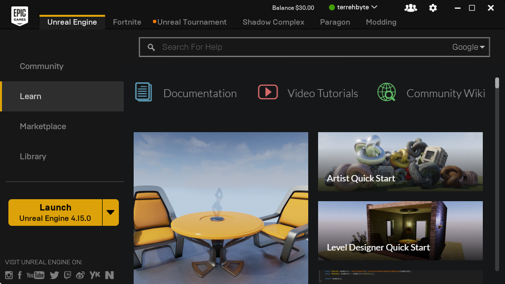
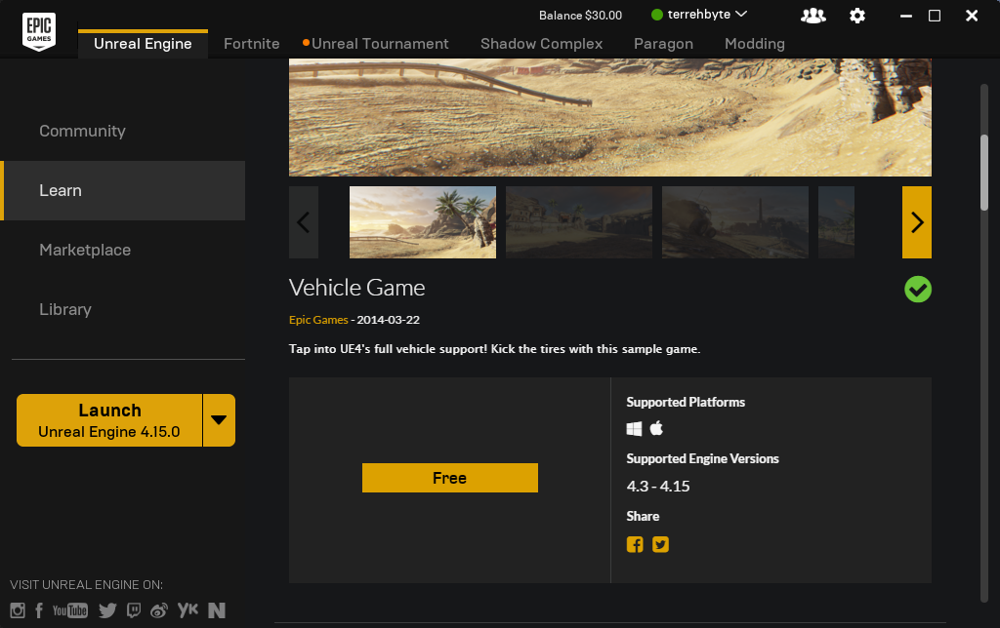
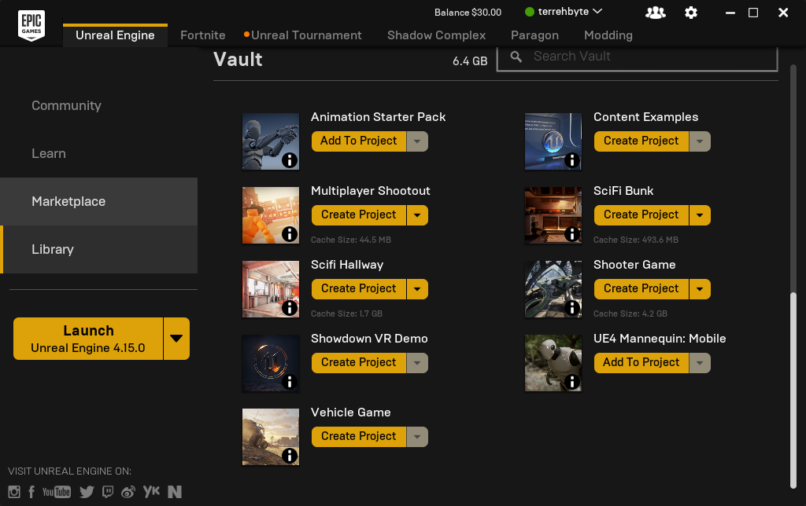
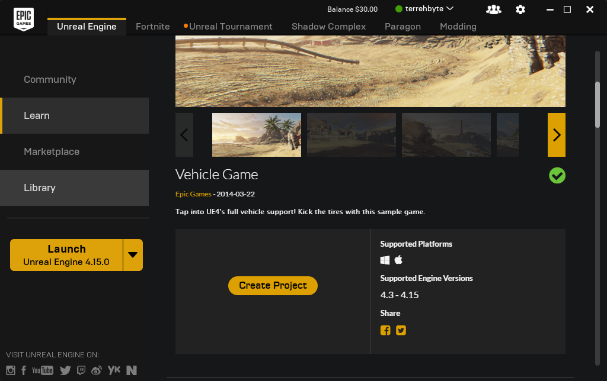
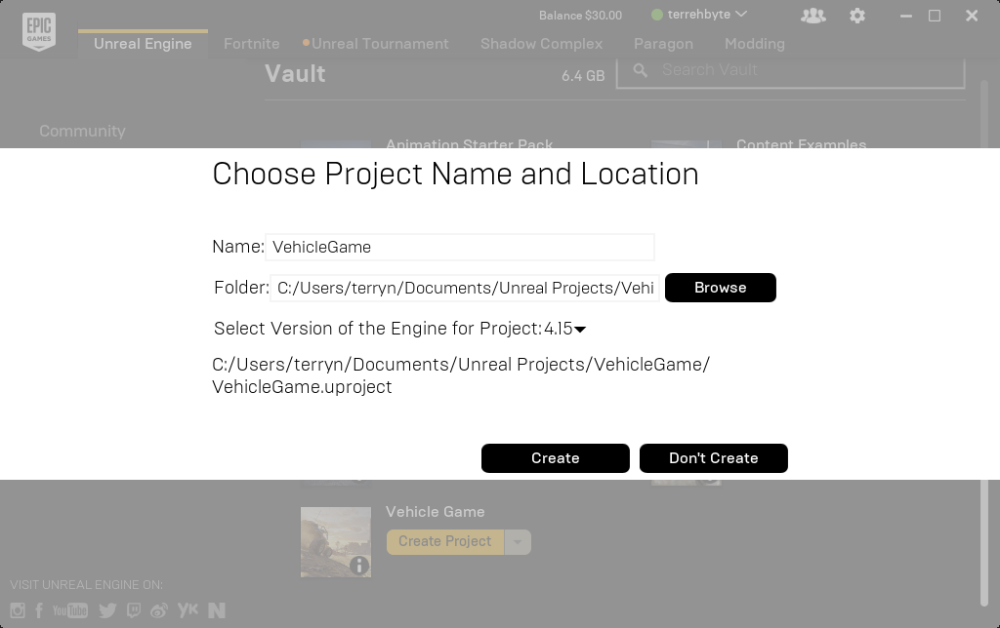
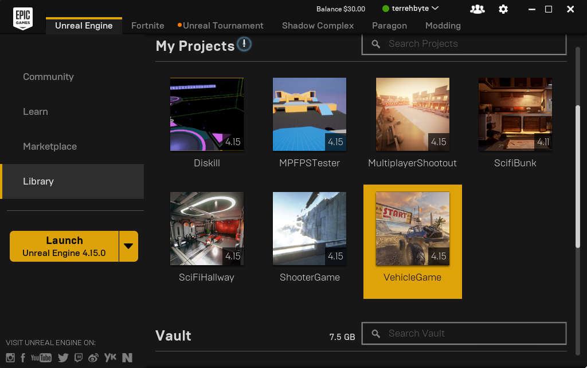

# Epic Games' Samples and Projects

The combination of a sparse amount of documentation and a budding community can
make it difficult to break into something as complex as Unreal Engine 4. You can
glean some good gems in the form of snippets and assets from their content
and project samples.

It's a little non-trivial to access, but you might find it worth doing.

Before proceeding, make sure that you have an [Epic Games Account](unrealengine.com/login)
and have installed the Epic Games Launcher on your computer.

**Contents**

1. [Browse the Learn tab](#browse-the-learn-tab)
2. [Creating a Project Using Downloaded Content](#creating-a-project-using-downloaded-content)
3. [Opening up the Project](#opening-up-the-project)

## Browse the Learn tab

Open up the Epic Games Launcher and open up the "Learn" tab in the Unreal Engine
menu. This brings you to all of the provided sample materials.

Clicking on one of the tiles, such as the "Vehicle Game" example game, will
bring you to its launcher page which provides additional information. After
confirming that you'd like to add this to your account, click the "Free" button.

Congrats! You should have access to that in the future.

## Creating a Project Using Downloaded Content

You can create a project by visiting your library in the "Unreal Engine" tab
and selecting the "Create Project" button associated with what you'd like to
create a project of.

> **First Time Downloading That Content?**
>
> If this is your first time creating a project, then the launcher will need to
> download the assets first.

You can also create it from the product page where you initially added it to
your Epic Games Account in the first place. You should be presented with the
same dialog as the method shown above.

When presented with the project creation dialog, make sure to pay attention to
the version of Unreal Engine 4 that you're creating the project for as well as
the location of the project.

After the project is created, you can visit it at any time by visiting your
launcher and selecting it from your list of projects. You can also open the
UPROJECT file that is created inside of your project folder.